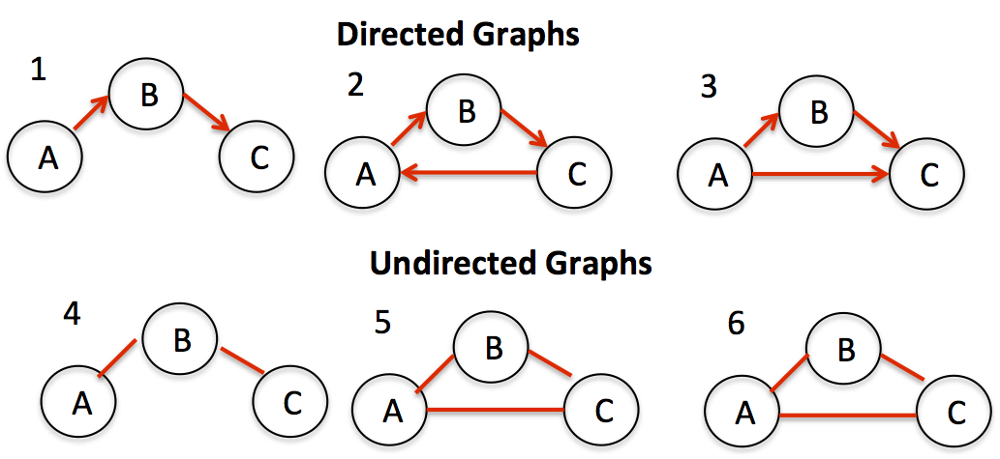
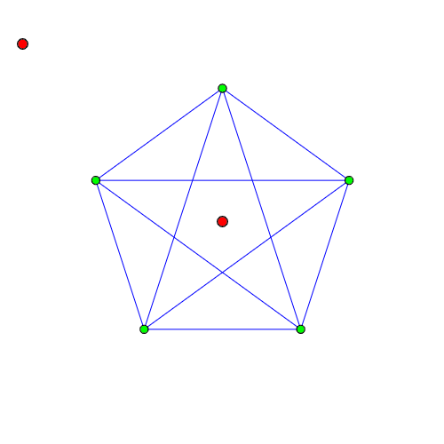

# Graphs

>Graphs are non linear and are usually looked at as a collection of `Nodes` with potentially connected by `Edges`.

## Real World Graphs Examples

- Airlines
- NYC Subway
- Transit/Bus systems
- Maps GPS system
- A matrix Video game like Snake

---

## Key terms

- Vertex: aka node
- Edge: a relationship between 2 nodes
- Neighbor: connected by an edge
- Degree: number of edges connected to that vertex.

---

Here are a few types of graphs as an example:

### Directed-Graph & Undirected-Graph

  

### Complete-Graph

  

  The most common way to display a graph is:

```javascript
[ node 1 ] --> node 2 --> node 4
[ node 2 ] --> node 5
[ node 3 ] --> node 2
[ node 4 ] --> node 5
[ node 5 ]
[ node 6 ] --> node 3 --> node 5

```

### Recources

- [Graphs](https://codefellows.github.io/common_curriculum/data_structures_and_algorithms/Code_401/class-35/resources/graphs.html)
